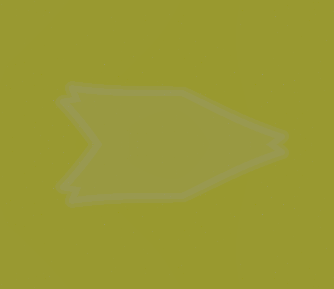
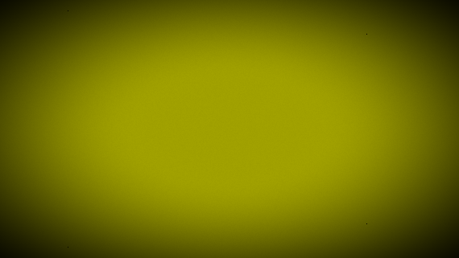
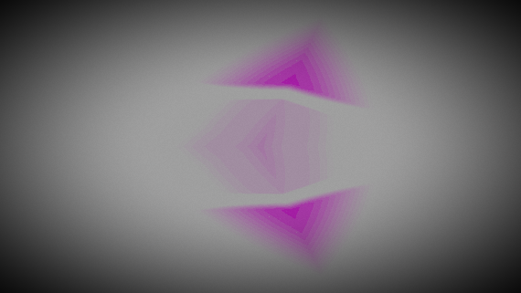
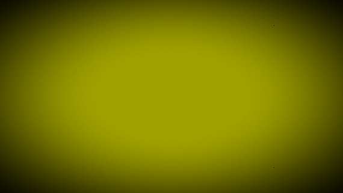
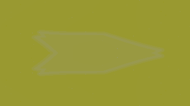
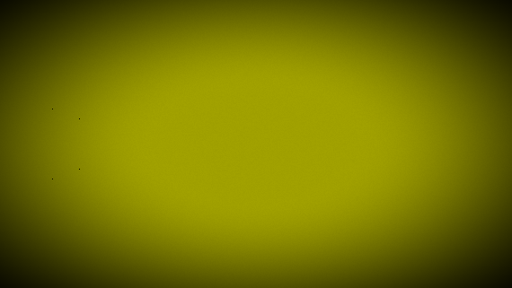
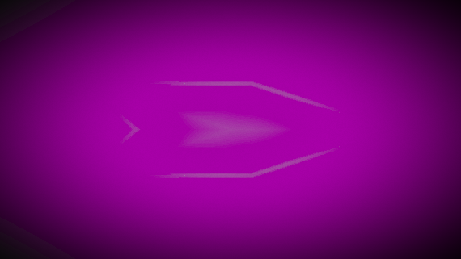
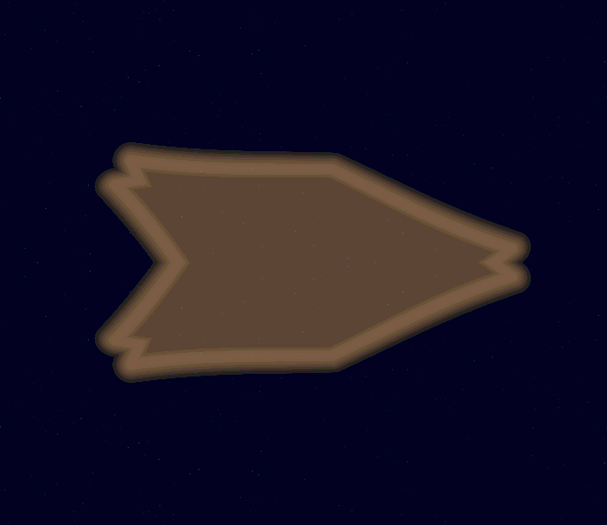
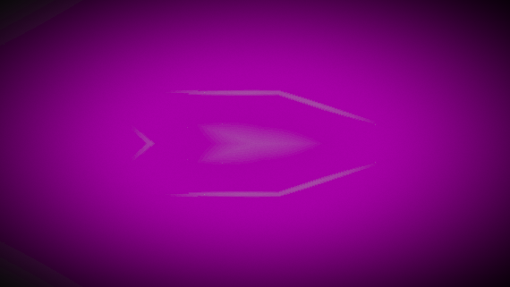

# Visual Synth - Visual Verification Guide

This guide helps verify that VisualSynth is working correctly by taking screenshots at key verification points. Each section includes a description of what should be visible and a placeholder for the screenshot.

---

## Verification Checklist

Use this guide to verify all major features are functioning correctly. Take screenshots at each checkpoint and compare against the expected description.

---

## 1. Application Launch

### 1.1 Initial Screen

**What to see**:
- VisualSynth application window opens
- Top bar with logo, mode buttons (Performance, Scene, Design, Matrix, System)
- Center canvas showing default visuals
- Left panel showing Performance mode controls
- Right panel showing Macros
- Status bar at bottom

**Screenshot**:


*Expected: Full application window with default UI layout*

**Verification**:
- [ ] Window opens without errors
- [ ] All UI elements are visible
- [ ] Canvas is displaying visual output (not black)

---

## 2. Audio Setup Verification

### 2.1 Audio Device Selection

**What to see**:
- Switch to System mode
- Audio Input dropdown populated with available devices
- Default audio device selected

**Screenshot**:


*Expected: System mode left panel with audio device dropdown*

**Verification**:
- [ ] Audio devices are listed
- [ ] Can select different audio devices
- [ ] Selection persists

### 2.2 Audio Response

**What to see**:
- Play audio on selected device
- Visuals respond to audio (plasma moves, spectrum bars animate)
- Health strip shows activity

**Screenshot**:


*Expected: Visual output showing movement/spectrum activity*

**Verification**:
- [ ] Visuals respond to audio input
- [ ] Spectrum bars animate with music
- [ ] Plasma layer responds to volume changes

---

## 3. Mode Switching Verification

### 3.1 Performance Mode

**What to see**:
- Mode button "Performance" highlighted
- Scene Strip panel visible on left
- 64-Pad grid visible
- Macros panel on right

**Screenshot**:


*Expected: Performance mode full UI*

**Verification**:
- [ ] All Performance mode controls visible
- [ ] Pad grid is responsive
- [ ] Scene strip shows scenes

### 3.2 Scene Mode

**What to see**:
- Mode button "Scene" highlighted
- Layer list visible on left
- Generator Library visible
- Style Presets panel on right

**Screenshot**:


*Expected: Scene mode UI with layer list*

**Verification**:
- [ ] Layer list displays correctly
- [ ] Generator library dropdown works
- [ ] Can add/remove layers

### 3.3 Design Mode

**What to see**:
- Mode button "Design" highlighted
- Layer Effects panel on left
- SDF Shapes controls visible
- Assets panel on right

**Screenshot**:


*Expected: Design mode UI with effects controls*
```

**Verification**:
- [ ] Effect sliders are present
- [ ] Color palette selector works
- [ ] SDF controls are visible

### 3.4 Matrix Mode

**What to see**:
- Mode button "Matrix" highlighted
- Mod Matrix visible in center
- Modulators panel on right (LFOs, Envelopes, S&H)

**Screenshot**:


*Expected: Matrix mode with modulators*

**Verification**:
- [ ] Mod Matrix list is visible
- [ ] Can add modulation routings
- [ ] LFO/Envelope controls work

### 3.5 System Mode

**What to see**:
- Mode button "System" highlighted
- Device selection panels on left
- Diagnostics panel on right

**Screenshot**:


*Expected: System mode with diagnostics*

**Verification**:
- [ ] Audio/MIDI device selection works
- [ ] Diagnostics show FPS and latency
- [ ] Save/Load buttons work

---

## 4. Visual Generators Verification

### 4.1 Shader Plasma Layer

**What to see**:
- Load preset "Cosmic Plasma" or "Slow Plasma"
- Fluid, organic color patterns moving
- Colors shift smoothly over time
- Movement responds to audio

**Screenshot**:


*Expected: Colorful fluid plasma patterns*

**Verification**:
- [ ] Plasma patterns are smooth
- [ ] Colors are vibrant
- [ ] Movement is continuous
- [ ] Responds to audio volume

### 4.2 Spectrum Bars Layer

**What to see**:
- Load preset "Spectrum" or "Soft Spectrum"
- Vertical bars across the screen
- Bar heights match audio frequencies
- Colors shift based on frequency

**Screenshot**:


*Expected: Vertical spectrum bars*

**Verification**:
- [ ] Bars animate with music
- [ ] High frequencies on right, low on left
- [ ] Colors are visible

### 4.3 Origami Fold Layer

**What to see**:
- Load preset "Origami Storm"
- Geometric fold patterns
- Light/dark contrast creating depth
- Patterns shift with audio

**Screenshot**:


*Expected: Geometric origami fold patterns*

**Verification**:
- [ ] Fold lines are visible
- [ ] Creates 3D-like depth
- [ ] Responds to audio dynamics

### 4.4 Glyph Language Layer

**What to see**:
- Load preset "Glyph Matrix"
- Procedural symbols/glyphs
- Symbols arranged in a grid
- Symbols change with audio

**Screenshot**:


*Expected: Grid of procedural glyphs*

**Verification**:
- [ ] Glyphs are clearly visible
- [ ] Grid structure is visible
- [ ] Glyphs animate with audio

### 4.5 Crystal Harmonics Layer

**What to see**:
- Load preset "Crystal Harmonics" or "Crystal Cavern"
- Crystal/glass-like formations
- Light refraction effects
- Shimmering appearance

**Screenshot**:


*Expected: Crystal/glass formations*

**Verification**:
- [ ] Crystal shapes visible
- [ ] Light/shadow effects present
- [ ] Shimmering animation

### 4.6 Ink Flow Layer

**What to see**:
- Load preset "Ink Flow" or "Ink Blot"
- Brush-stroke style lines
- Flowing movement
- Ink-like appearance

**Screenshot**:


*Expected: Ink flow brush strokes*

**Verification**:
- [ ] Brush strokes visible
- [ ] Flowing movement
- [ ] Ink-like texture

### 4.7 Topo Terrain Layer

**What to see**:
- Load preset "Topo Terrain" or "Topo Zoom"
- Topographic map-like appearance
- Contour lines visible
- Terrain-like depth

**Screenshot**:


*Expected: Topographic terrain patterns*

**Verification**:
- [ ] Contour lines visible
- [ ] Terrain-like depth
- [ ] Responds to audio

### 4.8 Audio Weather Layer

**What to see**:
- Load preset "Audio Weather" or "Weather Hurricane"
- Weather effects (rain, snow, clouds)
- Lightning on audio peaks
- Intensity varies with music

**Screenshot**:


*Expected: Weather effects (rain/snow)*

**Verification**:
- [ ] Rain/snow particles visible
- [ ] Clouds/fog visible (depending on mode)
- [ ] Lightning flashes on peaks

### 4.9 Wormhole Portal Layer

**What to see**:
- Load preset "Wormhole Portals"
- Circular portal distortions
- Warping space effect
- Multiple portals possible

**Screenshot**:


*Expected: Portal/wormhole distortion*

**Verification**:
- [ ] Circular portal shapes visible
- [ ] Distortion around portals
- [ ] Warping effect on background

### 4.10 Sacred Oscilloscope Layer

**What to see**:
- Load preset "Sacred Oscilloscope"
- Circular oscilloscope pattern
- Waveform traced in a circle
- Audio waveform visible

**Screenshot**:


*Expected: Circular oscilloscope*

**Verification**:
- [ ] Circular waveform visible
- [ ] Waveform matches audio
- [ ] Smooth animation

---

## 5. Effects Verification

### 5.1 Bloom Effect

**What to see**:
- Enable Bloom in Design mode
- Set Bloom to 0.5
- Glowing highlights on bright areas
- Soft light bloom around elements

**Screenshot**:


*Expected: Bloom glow effect*

**Verification**:
- [ ] Highlights glow
- [ ] Bloom is soft
- [ ] Doesn't wash out image

### 5.2 Blur Effect

**What to see**:
- Enable Blur
- Set Blur to 0.5
- Soft, blurred appearance
- Loss of fine detail

**Screenshot**:


*Expected: Blurred visual*

**Verification**:
- [ ] Image is blurred
- [ ] Blur is even
- [ ] No artifacts

### 5.3 Chromatic Aberration Effect

**What to see**:
- Enable Chromatic
- Set Chromatic to 0.3
- RGB color splitting
- Edges show color fringing

**Screenshot**:


*Expected: RGB color splitting*

**Verification**:
- [ ] RGB colors separated
- [ ] Fringing on edges
- [ ] Creates glitch effect

### 5.4 Posterize Effect

**What to see**:
- Enable Posterize
- Set Posterize to 0.5
- Reduced color palette
- Banding visible
- Retro/8-bit appearance

**Screenshot**:
```
[PLACEHOLDER: effect-posterize.png]
Expected: Posterized/banded colors
```

**Verification**:
- [ ] Color banding visible
- [ ] Reduced color count
- [ ] Retro appearance

### 5.5 Kaleidoscope Effect

**What to see**:
- Enable Kaleidoscope
- Set Kaleidoscope to 0.5
- Mirrored/symmetric pattern
- Mandala-like appearance
- Multiple segments

**Screenshot**:
```
[PLACEHOLDER: effect-kaleidoscope.png]
Expected: Kaleidoscope mirror effect
```

**Verification**:
- [ ] Symmetrical pattern
- [ ] Multiple segments visible
- [ ] Creates mandala effect

### 5.6 Feedback Effect

**What to see**:
- Enable Feedback
- Set Feedback to 0.3
- Enable Persistence to 0.5
- Trails from previous frames
- Echo/memory effect

**Screenshot**:
```
[PLACEHOLDER: effect-feedback.png]
Expected: Trail/echo effect
```

**Verification**:
- [ ] Trails visible
- [ ] Motion has echo
- [ ] Smooth decay

---

## 6. Particle Field Verification

**What to see**:
- Load preset "Particle Swarm"
- Enable Particles
- Small glowing dots/particles
- Particles move and twinkle
- Count varies with density setting

**Screenshot**:
```
[PLACEHOLDER: generator-particles.png]
Expected: Particle field with glowing dots
```

**Verification**:
- [ ] Particles visible
- [ ] Particles move
- [ ] Twinkle effect
- [ ] Density slider works

---

## 7. SDF Shapes Verification

### 7.1 Simple SDF Shapes

**What to see**:
- Load preset "SDF Geometry 101"
- Enable SDF
- Select Shape: Circle, Box, or Triangle
- Clean geometric shape
- Edge glow effect
- Fill color

**Screenshot**:
```
[PLACEHOLDER: sdf-shapes-simple.png]
Expected: Clean SDF circle/box/triangle
```

**Verification**:
- [ ] Shape is crisp
- [ ] Edge glow visible
- [ ] Fill color visible
- [ ] Rotation works
- [ ] Scale works

### 7.2 Advanced SDF Scene

**What to see**:
- Load preset "SDF Monolith" or "SDF Orbit"
- Enable "Use Advanced Node Scene"
- Complex 3D-looking shapes
- Lighting/shading effects
- Multiple shapes combined

**Screenshot**:
```
[PLACEHOLDER: sdf-scene-advanced.png]
Expected: Complex SDF scene with lighting
```

**Verification**:
- [ ] 3D-like appearance
- [ ] Lighting/shading visible
- [ ] Multiple shapes
- [ ] Smooth rendering

---

## 8. Visualizer Overlays Verification

### 8.1 Spectrum Visualizer

**What to see**:
- Load preset with visualizer
- Set Visualizer Mode to "Spectrum"
- Enable Visualizer
- Spectrum bars overlaid on main visual
- Bars animate with audio

**Screenshot**:
```
[PLACEHOLDER: visualizer-spectrum.png]
Expected: Spectrum overlay on main visual
```

**Verification**:
- [ ] Overlay is visible
- [ ] Bars animate
- [ ] Opacity slider works

### 8.2 Waveform Visualizer

**What to see**:
- Set Visualizer Mode to "Waveform"
- Waveform line overlaid
- Line follows audio waveform
- Oscilloscope-style display

**Screenshot**:
```
[PLACEHOLDER: visualizer-waveform.png]
Expected: Waveform line overlay
```

**Verification**:
- [ ] Waveform line visible
- [ ] Follows audio
- [ ] Smooth rendering

### 8.3 Oscilloscope Visualizer

**What to see**:
- Set Visualizer Mode to "Oscilloscope"
- Circular oscilloscope overlay
- Audio waveform in circle
- Classic oscilloscope look

**Screenshot**:
```
[PLACEHOLDER: visualizer-oscilloscope.png]
Expected: Circular oscilloscope overlay
```

**Verification**:
- [ ] Circular waveform
- [ ] Classic oscilloscope look
- [ ] Responds to audio

---

## 9. Preset Verification

### 9.1 Preset Browser

**What to see**:
- Go to Performance mode
- Preset Explorer panel visible
- Preset dropdown populated
- Preset list showing presets
- Category filter working

**Screenshot**:
```
[PLACEHOLDER: preset-browser.png]
Expected: Preset browser with preset list
```

**Verification**:
- [ ] All presets listed
- [ ] Category filter works
- [ ] Shuffle works
- [ ] Previous/Next buttons work

### 9.2 Preset Loading

**What to see**:
- Select "Cosmic Plasma" preset
- Click "Add Preset as Scene"
- Scene appears in Scene Strip
- Visuals update to preset appearance

**Screenshot**:
```
[PLACEHOLDER: preset-loaded.png]
Expected: Cosmic Plasma preset visuals
```

**Verification**:
- [ ] Preset loads correctly
- [ ] Visuals match preset name
- [ ] No errors

### 9.3 Preset Categories

Test presets from different categories:

#### Essentials (1-10)
Test: Preset 01 Cosmic, 02 Spectrum, 03 Ambient
```
[PLACEHOLDER: presets-essentials.png]
```

#### VisualSynth DNA (11-29)
Test: Preset 11 Feedback, 12 Bloom, 13 Plasma
```
[PLACEHOLDER: presets-dna.png]
```

#### SDF Shapes (100-109)
Test: Preset 100 Monolith, 101 Pulse, 102 Orbit
```
[PLACEHOLDER: presets-sdf.png]
```

---

## 10. Macros Verification

### 10.1 Macro Controls

**What to see**:
- Go to Performance mode
- Macros panel visible (8 sliders)
- Each slider has a name
- Sliders respond to mouse input

**Screenshot**:
```
[PLACEHOLDER: macros-panel.png]
Expected: 8 macro sliders with labels
```

**Verification**:
- [ ] 8 macros visible
- [ ] Sliders work
- [ ] Labels visible
- [ ] Can rename macros

### 10.2 Macro to Parameter Mapping

**What to see**:
- Load "Cosmic Plasma" preset
- Adjust Macro 1 (Plasma Speed)
- Plasma speed changes in real-time
- Visual feedback on canvas

**Screenshot**:
```
[PLACEHOLDER: macro-mapping.png]
Expected: Visual changing with macro movement
```

**Verification**:
- [ ] Macro affects parameter
- [ ] Change is immediate
- [ ] No lag

---

## 11. Modulation Matrix Verification

### 11.1 Add Modulation

**What to see**:
- Go to Matrix mode
- Click "Add Mod"
- New row appears in Mod Matrix
- Can select source and target

**Screenshot**:
```
[PLACEHOLDER: mod-matrix-add.png]
Expected: New modulation row in matrix
```

**Verification**:
- [ ] New row created
- [ ] Source dropdown works
- [ ] Target dropdown works

### 11.2 LFO Modulation

**What to see**:
- Create LFO modulation
- LFO output visible in parameter
- Smooth oscillation

**Screenshot**:
```
[PLACEHOLDER: lfo-modulation.png]
Expected: Parameter oscillating smoothly
```

**Verification**:
- [ ] Oscillation visible
- [ ] Rate affects speed
- [ ] Smooth movement

### 11.3 Audio Modulation

**What to see**:
- Create audio to parameter modulation
- Parameter responds to audio
- Response follows audio dynamics

**Screenshot**:
```
[PLACEHOLDER: audio-modulation.png]
Expected: Parameter responding to music
```

**Verification**:
- [ ] Responds to audio
- [ ] Follows dynamics
- [ ] Amount controls intensity

---

## 12. Pad Grid Verification

### 12.1 Pad Grid Display

**What to see**:
- Go to Performance mode
- 8x8 pad grid visible
- Bank buttons (A/B/C/D)
- Pads highlight when pressed

**Screenshot**:
```
[PLACEHOLDER: pad-grid.png]
Expected: 8x8 pad grid with bank buttons
```

**Verification**:
- [ ] 64 pads visible
- [ ] Bank buttons work
- [ ] Pads clickable

### 12.2 Default Pad Actions

**What to see**:
- Press pad 0-31 (Bank A)
- Plasma layer toggles
- Press pad 32-63 (Bank A)
- Strobe flashes

**Screenshot**:
```
[PLACEHOLDER: pad-actions.png]
Expected: Pad triggering effect
```

**Verification**:
- [ ] Pads trigger effects
- [ ] Visual feedback on press
- [ ] Multiple pads can be active

### 12.3 Bank Switching

**What to see**:
- Click Bank B button
- Bank B highlights
- Pad actions change
- Repeat for Banks C and D

**Screenshot**:
```
[PLACEHOLDER: bank-switching.png]
Expected: Different bank selected
```

**Verification**:
- [ ] Banks switch correctly
- [ ] Active bank highlighted
- [ ] Pad actions change

---

## 13. MIDI Verification

### 13.1 MIDI Device Selection

**What to see**:
- Go to System mode
- MIDI device dropdown populated
- Can select MIDI device
- "Enable MIDI" button works

**Screenshot**:
```
[PLACEHOLDER: midi-selection.png]
Expected: MIDI device dropdown
```

**Verification**:
- [ ] MIDI devices listed
- [ ] Can select device
- [ ] Enable button works

### 13.2 MIDI Mapping

**What to see**:
- Go to Matrix mode
- MIDI Mapping panel visible
- Can add new mapping
- Mapping list shows active mappings

**Screenshot**:
```
[PLACEHOLDER: midi-mapping.png]
Expected: MIDI mapping list
```

**Verification**:
- [ ] Can add mapping
- [ ] Mapping list shows mappings
- [ ] Can remove mapping

### 13.3 MIDI Learn Mode

**What to see**:
- Click parameter with learn target
- Move MIDI control
- Mapping created automatically
- Visual confirmation

**Screenshot**:
```
[PLACEHOLDER: midi-learn.png]
Expected: Parameter mapped after MIDI move
```

**Verification**:
- [ ] Learn mode activates
- [ ] MIDI control detected
- [ ] Mapping created
- [ ] Control works

---

## 14. Output Window Verification

### 14.1 Open Output Window

**What to see**:
- Go to System mode
- Click "Open Output"
- New window opens
- Shows same visual as canvas

**Screenshot**:
```
[PLACEHOLDER: output-window.png]
Expected: Separate output window
```

**Verification**:
- [ ] Output window opens
- [ ] Visuals match canvas
- [ ] Window is stable

### 14.2 Fullscreen Output

**What to see**:
- Enable "Fullscreen" checkbox
- Output window goes fullscreen
- Visuals fill entire screen
- Press F or Esc to exit

**Screenshot**:
```
[PLACEHOLDER: output-fullscreen.png]
Expected: Fullscreen output (take from other display)
```

**Verification**:
- [ ] Fullscreen works
- [ ] Visuals fill screen
- [ ] Can exit fullscreen

### 14.3 Resolution Scaling

**What to see**:
- Set output scale to 50%
- Output resolution decreases
- Visuals may appear lower quality
- FPS should improve

**Screenshot**:
```
[PLACEHOLDER: output-scaling.png]
Expected: Output showing resolution
```

**Verification**:
- [ ] Scale dropdown works
- [ ] Resolution updates
- [ ] FPS may change

---

## 15. Recording Verification

### 15.1 Screenshot

**What to see**:
- Press P or click "Screenshot"
- File saved dialog
- PNG file created
- File matches current visual

**Screenshot**:
```
[PLACEHOLDER: screenshot-result.png]
Expected: Screenshot PNG file
```

**Verification**:
- [ ] Screenshot captured
- [ ] File is valid PNG
- [ ] Visuals match

### 15.2 Video Recording

**What to see**:
- Click "Start Recording"
- Status shows "Recording"
- Timer increments
- Click "Stop Recording"
- WebM/MP4 file created

**Screenshot**:
```
[PLACEHOLDER: recording-status.png]
Expected: Recording status with timer
```

**Verification**:
- [ ] Recording starts
- [ ] Timer works
- [ ] File is created
- [ ] File plays correctly

---

## 16. Diagnostics Verification

### 16.1 FPS Display

**What to see**:
- Go to System mode
- Diagnostics panel shows FPS
- FPS should be near 60
- FPS updates periodically

**Screenshot**:
```
[PLACEHOLDER: diagnostics-fps.png]
Expected: Diagnostics showing FPS value
```

**Verification**:
- [ ] FPS displayed
- [ ] FPS is reasonable (30-60)
- [ ] FPS updates

### 16.2 Latency Display

**What to see**:
- Diagnostics show latency values
- Audio latency visible
- Output latency visible
- MIDI latency visible

**Screenshot**:
```
[PLACEHOLDER: diagnostics-latency.png]
Expected: Latency values in diagnostics
```

**Verification**:
- [ ] All latencies displayed
- [ ] Values are reasonable
- [ ] No "N/A" (unless expected)

### 16.3 WebGL Diagnostics

**What to see**:
- WebGL2 status shown
- GPU information visible
- "Copy WebGL Diagnostics" button works

**Screenshot**:
```
[PLACEHOLDER: diagnostics-webgl.png]
Expected: WebGL information
```

**Verification**:
- [ ] WebGL2 enabled
- [ ] GPU info shown
- [ ] Copy button works

---

## 17. Scene Management Verification

### 17.1 Add Blank Scene

**What to see**:
- Go to Performance mode
- Click "New Blank Scene"
- New scene appears in Scene Strip
- Can select new scene

**Screenshot**:
```
[PLACEHOLDER: add-blank-scene.png]
Expected: New scene in scene strip
```

**Verification**:
- [ ] Scene created
- [ ] Appears in list
- [ ] Can select

### 17.2 Scene Switching

**What to see**:
- Select different scene
- Visuals change to new scene
- Smooth transition
- No errors

**Screenshot**:
```
[PLACEHOLDER: scene-switch.png]
Expected: Different scene visuals
```

**Verification**:
- [ ] Scene switches
- [ ] Visuals update
- [ ] Smooth transition

### 17.3 Scene Quantization

**What to see**:
- Set Quantize to "1 Bar"
- Click "Queue Scene"
- Countdown overlay appears
- Scene switches on beat

**Screenshot**:
```
[PLACEHOLDER: quantization-hud.png]
Expected: Countdown overlay
```

**Verification**:
- [ ] HUD appears
- [ ] Countdown works
- [ ] Switch on beat

---

## 18. Project Save/Load Verification

### 18.1 Save Project

**What to see**:
- Go to System mode
- Click "Save"
- File dialog opens
- Enter filename
- File saved successfully

**Screenshot**:
```
[PLACEHOLDER: save-project.png]
Expected: Save dialog or confirmation
```

**Verification**:
- [ ] Dialog opens
- [ ] Can enter name
- [ ] Save succeeds

### 18.2 Load Project

**What to see**:
- Click "Load"
- File dialog opens
- Select saved project
- Project loads with all settings

**Screenshot**:
```
[PLACEHOLDER: load-project.png]
Expected: Project loaded with correct visuals
```

**Verification**:
- [ ] Dialog opens
- [ ] Can select file
- [ ] Project loads correctly
- [ ] Settings preserved

---

## 19. Layer Management Verification

### 19.1 Add Layer

**What to see**:
- Go to Scene mode
- Select generator from dropdown
- Click "Add Generator"
- Layer appears in list
- Visual updates

**Screenshot**:
```
[PLACEHOLDER: add-layer.png]
Expected: New layer in layer list
```

**Verification**:
- [ ] Layer added
- [ ] Appears in list
- [ ] Visuals update

### 19.2 Remove Layer

**What to see**:
- Click remove button on layer
- Layer disappears from list
- Visuals update
- No errors

**Screenshot**:
```
[PLACEHOLDER: remove-layer.png]
Expected: Layer removed, visuals changed
```

**Verification**:
- [ ] Layer removed
- [ ] Visuals update
- [ ] No artifacts

### 19.3 Reorder Layers

**What to see**:
- Drag layer to new position
- Layer order changes
- Visual blend order changes
- Order persists

**Screenshot**:
```
[PLACEHOLDER: reorder-layers.png]
Expected: Layers in new order
```

**Verification**:
- [ ] Drag works
- [ ] Order changes
- [ ] Visuals reflect new order

### 19.4 Layer Blend Modes

**What to see**:
- Select different blend mode
- Visual blend changes
- Try Normal, Add, Multiply, Screen, Overlay, Difference

**Screenshot**:
```
[PLACEHOLDER: blend-modes.png]
Expected: Different blend mode appearance
```

**Verification**:
- [ ] Blend mode changes
- [ ] Visuals update
- [ ] Each mode has distinct look

---

## 20. Color Palette Verification

### 20.1 Palette Selection

**What to see**:
- Go to Design mode
- Select different palette
- Colors update on canvas
- Preview shows palette colors

**Screenshot**:
```
[PLACEHOLDER: palette-selection.png]
Expected: Different color palette
```

**Verification**:
- [ ] Palette changes
- [ ] Colors update
- [ ] Preview accurate

### 20.2 Style Presets

**What to see**:
- Go to Scene mode
- Select different style preset
- Contrast/saturation/shift changes
- Visual grading updates

**Screenshot**:
```
[PLACEHOLDER: style-presets.png]
Expected: Different style preset appearance
```

**Verification**:
- [ ] Style changes
- [ ] Contrast affects image
- [ ] Saturation affects colors
- [ ] Shift affects hue

---

## 21. Asset Import Verification

### 21.1 Import Texture

**What to see**:
- Go to Design mode
- Select "Texture" from asset kind
- Click "Import Texture/Shader"
- Select image file
- Asset appears in asset list
- Asset can be assigned to layer

**Screenshot**:
```
[PLACEHOLDER: import-texture.png]
Expected: Imported texture visible
```

**Verification**:
- [ ] Dialog opens
- [ ] File imports
- [ ] Appears in list
- [ ] Can be used

### 21.2 Import Video

**What to see**:
- Select "Video" from asset kind
- Click "Import Video"
- Select video file
- Asset appears in list
- Video plays in preview

**Screenshot**:
```
[PLACEHOLDER: import-video.png]
Expected: Imported video playing
```

**Verification**:
- [ ] Video imports
- [ ] Plays correctly
- [ ] Controls work (loop, reverse, rate)

### 21.3 Text Layer

**What to see**:
- Enter text in text input
- Click "Add Text Layer"
- Text appears on canvas
- Font and size adjustable

**Screenshot**:
```
[PLACEHOLDER: text-layer.png]
Expected: Text overlay on visual
```

**Verification**:
- [ ] Text appears
- [ ] Font works
- [ ] Color works
- [ ] Can be removed

---

## 22. Health & Performance Verification

### 22.1 FPS Stability

**What to see**:
- Monitor FPS for 1 minute
- FPS should stay above 30
- No major drops
- Watchdog shows "OK"

**Screenshot**:
```
[PLACEHOLDER: fps-stability.png]
Expected: Health strip showing good FPS
```

**Verification**:
- [ ] FPS stable
- [ ] Above 30 FPS
- [ ] Watchdog OK

### 22.2 Memory Usage

**What to see**:
- Monitor task manager
- Memory usage stable
- No memory leaks
- Usage reasonable

**Screenshot**:
```
[PLACEHOLDER: memory-usage.png]
Expected: Task manager showing reasonable memory
```

**Verification**:
- [ ] Memory stable
- [ ] No leaks
- [ ] Under 2GB typical

---

## Summary Verification Checklist

After completing all verification steps, review this summary:

**Core Functionality**:
- [ ] Application launches and runs
- [ ] Audio input works
- [ ] Visuals respond to audio
- [ ] All UI modes switch correctly
- [ ] FPS is stable (30+)

**Visual Generators**:
- [ ] All 10 layer generators work
- [ ] Particles work
- [ ] SDF shapes work (simple and advanced)
- [ ] Visualizer overlays work

**Effects**:
- [ ] All 7 effects work individually
- [ ] Effects stack correctly
- [ ] No artifacts or glitches

**Control Systems**:
- [ ] Macros work
- [ ] Modulation matrix works
- [ ] LFOs, envelopes, S&H work
- [ ] Pad grid works
- [ ] MIDI works

**Content & Presets**:
- [ ] Presets load correctly
- [ ] All preset categories accessible
- [ ] Templates work
- [ ] Can save/load projects

**Output & Recording**:
- [ ] Output window works
- [ ] Fullscreen works
- [ ] Screenshots work
- [ ] Video recording works

**Diagnostics**:
- [ ] FPS display works
- [ ] Latency display works
- [ ] WebGL diagnostics work

---

## Troubleshooting Verification Issues

If any verification step fails:

1. **Check Diagnostics**: Look at the Diagnostics panel for error information
2. **Check Safe Mode**: See if Safe Mode banner indicates an issue
3. **Check Audio**: Verify audio input is working
4. **Check GPU**: Ensure WebGL2 is supported
5. **Restart**: Try restarting the application
6. **Update**: Check for updates

---

## Creating Your Verification Screenshots

**Instructions**:
1. Follow each verification step
2. Take a screenshot using `P` key or the Screenshot button
3. Save screenshots with the suggested filename
4. Place screenshots in a `docs/screenshots/` folder
5. Compare against expected descriptions

**Tools**:
- Windows: `Win + Shift + S` for screenshot tool
- Built-in screenshot: Press `P` in VisualSynth
- External tools: Snipping Tool, Greenshot, etc.

---

**Version**: 2.0
**Last Updated**: 2026-01-27